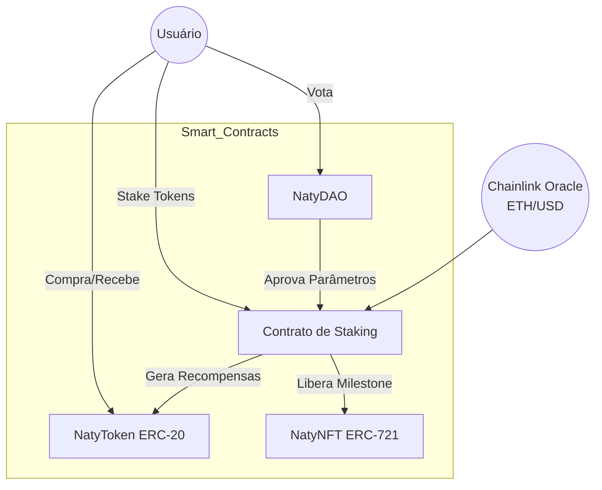

# Etapa 1: Modelagem e Arquitetura - Protocolo NatyWeb3

## 1. Definição do Problema
A comunidade em torno da Assistente Pessoal Naty carece de um sistema transparente e descentralizado para incentivar a colaboração e o suporte ao desenvolvimento contínuo. O **Protocolo NatyWeb3** resolve isso ao criar um ecossistema de recompensas baseado em tokens e governança comunitária.

**Objetivos:**
- Recompensar apoiadores com tokens utilitários (`NATY`).
- Oferecer benefícios exclusivos via NFTs.
- Permitir que a comunidade decida os rumos do projeto (DAO).

## 2. Diagrama de Arquitetura

## 3. Fluxo de Operação
1.  O usuário adquire tokens **NatyToken**.
2.  O usuário deposita tokens no **Contrato de Staking**.
3.  O contrato consulta o **Oráculo Chainlink** (Preço ETH/USD) para calcular o multiplicador de recompensas (ex: se o ETH subir, a recompensa em tokens NATY aumenta para manter atratividade).
4.  Após atingir um período de stake, o usuário pode realizar o mint de um **NatyNFT** exclusivo.
5.  O poder de voto na **NatyDAO** é proporcional ao saldo em stake.

## 4. Justificativa dos Padrões ERC
-   **ERC-20 (Fungível):** Escolhido para o `NatyToken` por ser o padrão de mercado para tokens de utilidade, garantindo compatibilidade com DEXs e carteiras (MetaMask).
-   **ERC-721 (Não Fungível):** Escolhido para o `NatyNFT` para garantir a raridade e unicidade dos certificados de apoiador "Founding Member".
