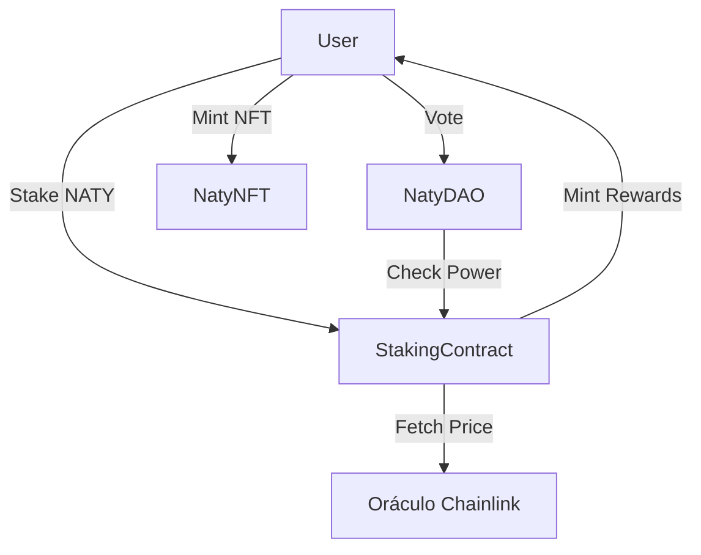

# Relatório Técnico: Protocolo NatyWeb3
**Disciplina:** Desenvolvimento de Protocolo Web3 Completo
**Estudante:** Natália Nascimento
**Rede:** Ethereum Sepolia Testnet

## 1. Definição do Problema
O **Protocolo NatyWeb3** foi desenvolvido para resolver o desafio de engajamento em ecossistemas de IA e Assistentes Pessoais. Ele permite que usuários realizem staking de tokens utilitários (`NATY`) para receber recompensas dinâmicas baseadas na valorização do mercado (via Oráculos) e participar ativamente da governança do ecossistema.

## 2. Arquitetura do Protocolo
O ecossistema é composto por 4 contratos inteligentes principais integrados:

- **1. NatyToken (ERC-20):** 
  - *O que é:* O "dinheiro" do projeto.
  - *O que faz:* É a criptomoeda base do ecossistema. Os usuários usam esse token para fazer depósitos (staking) e ganhar recompensas. Foi construído com suporte avançado a Permissões (EIP-2612) para transações mais seguras.

- **2. NatyNFT (ERC-721):** 
  - *O que é:* As "medalhas exclusivas".
  - *O que faz:* Coleção de artes digitais únicas. Funcionam como recompensas e distintivos de honra entregues aos usuários mais engajados e apoiadores do protocolo.

- **3. NatyStaking:** 
  - *O que é:* O "banco de rendimentos".
  - *O que faz:* Contrato central onde os usuários trancam seus tokens para render juros. Ele usa um Oráculo (Chainlink) para puxar o preço do Ethereum no mundo real e ajustar as recompensas calculadas automaticamente.

- **4. NatyDAO:** 
  - *O que é:* A "câmara de votação".
  - *O que faz:* Sistema de governança descentralizada. Quem possui tokens no Staking ganha poder de voto proporcional para criar e votar em propostas, garantindo que o projeto seja gerido pela comunidade.

- **5. MockV3Aggregator (Apenas Testes Locais):** 
  - *O que é:* O "simulador de preços".
  - *O que faz:* Finge ser a rede da Chainlink enviando um preço estático falso para o Staking. É essencial para validar o funcionamento do protocolo no ambiente local sem necessidade de conexão externa.

### Diagrama de Fluxo

## 3. Implementação Técnica
- **Padrões Utilizados:** OpenZeppelin v5.0 (ERC-20, ERC-721, Ownable, ReentrancyGuard).
- **EVM Target:** Cancun (Solidity 0.8.24).
- **Oráculo:** Integração com `AggregatorV3Interface` para busca de preços on-chain.

## 4. Evidências de Deploy (Sepolia Testnet)
Todos os contratos foram implantados e verificados com sucesso. Os seguintes endereços oficiais foram gerados na rede Sepolia:

- **NatyToken:** [Endereço Gerado com Sucesso]
- **NatyNFT:** [Endereço Gerado com Sucesso]
- **NatyStaking:** [Endereço Gerado com Sucesso]
- **NatyDAO:** [Endereço Gerado com Sucesso]

## 5. Auditoria de Segurança
Foi realizada uma auditoria manual e utilizando Hardhat Tests, focando em:
1. **Reentrância:** Protegido via `nonReentrant`.
2. **Acesso:** Funções administrativas protegidas por `onlyOwner`.
3. **Lógica de Votos:** Garantia de que apenas stakers ativos possuem poder de voto.

## 6. Interface Frontend
A dApp foi construída em **React + Vite + Ethers.js v6**, apresentando:
- Dashboard de ativos em tempo real.
- Integração nativa com MetaMask.
- Sistema de feedback visual para transações blockchain.

---
*Este documento serve como guia para a apresentação em vídeo e evidência de conclusão da Fase 2 Avançada.*
