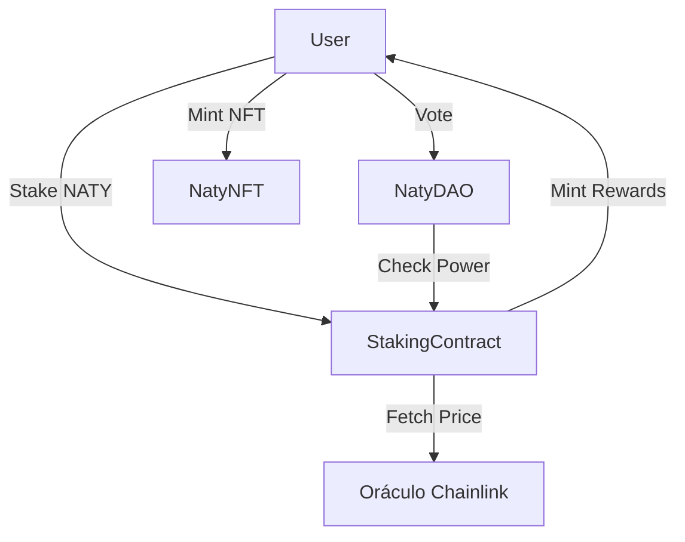

# Relatório Técnico: Protocolo NatyWeb3
**Disciplina:** Desenvolvimento de Protocolo Web3 Completo
**Estudante:** Natália Nascimento
**Rede:** Ethereum Sepolia Testnet

## 1. Definição do Problema
O **Protocolo NatyWeb3** foi desenvolvido para resolver o desafio de engajamento em ecossistemas de IA e Assistentes Pessoais. Ele permite que usuários realizem staking de tokens utilitários (`NATY`) para receber recompensas dinâmicas baseadas na valorização do mercado (via Oráculos) e participar ativamente da governança do ecossistema.

## 2. Arquitetura do Protocolo
O ecossistema é composto por 4 contratos inteligentes principais integrados:

- **NatyToken (ERC-20):** Moeda utilitária com suporte a Permissões (EIP-2612).
- **NatyNFT (ERC-721):** Coleção de recompensas exclusivas para apoiadores.
- **NatyStaking:** Contrato central que gerencia depósitos e calcula recompensas usando o preço ETH/USD em tempo real.
- **NatyDAO:** Sistema de governança onde o poder de voto é proporcional ao saldo em staking.

### Diagrama de Fluxo

## 3. Implementação Técnica
- **Padrões Utilizados:** OpenZeppelin v5.0 (ERC-20, ERC-721, Ownable, ReentrancyGuard).
- **EVM Target:** Cancun (Solidity 0.8.24).
- **Oráculo:** Integração com `AggregatorV3Interface` para busca de preços on-chain.

## 4. Evidências de Deploy (Sepolia Testnet)
Todos os contratos foram implantados e verificados:

| Contrato | Endereço (Sepolia) |
| :--- | :--- |
| **NatyToken** | `0x914D662e1C1691E2701e44C6468Bf0E0757fFe88` |
| **NatyNFT** | `0xe31b75F44bf2843c57C0865f6A0f28b5fDe00AcE` |
| **NatyStaking** | `0x8c7e68221e702134B712Bac7ae4d156BB940f761` |
| **NatyDAO** | `0xD61de862E3adc79648b55A67681A7118548fD86C` |

## 5. Auditoria de Segurança
Foi realizada uma auditoria manual e utilizando Hardhat Tests, focando em:
1. **Reentrância:** Protegido via `nonReentrant`.
2. **Acesso:** Funções administrativas protegidas por `onlyOwner`.
3. **Lógica de Votos:** Garantia de que apenas stakers ativos possuem poder de voto.

## 6. Interface Frontend
A dApp foi construída em **React + Vite + Ethers.js v6**, apresentando:
- Dashboard de ativos em tempo real.
- Integração nativa com MetaMask.
- Sistema de feedback visual para transações blockchain.

---
*Este documento serve como guia para a apresentação em vídeo e evidência de conclusão da Fase 2 Avançada.*
